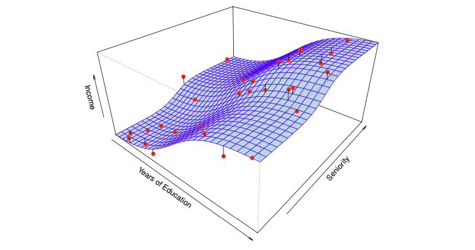
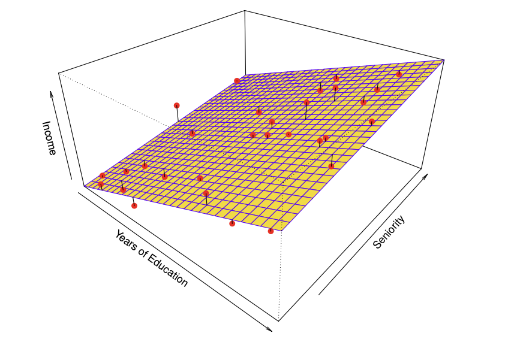
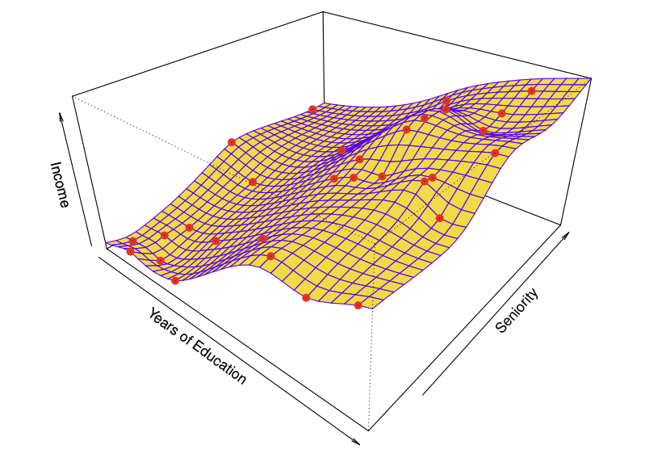
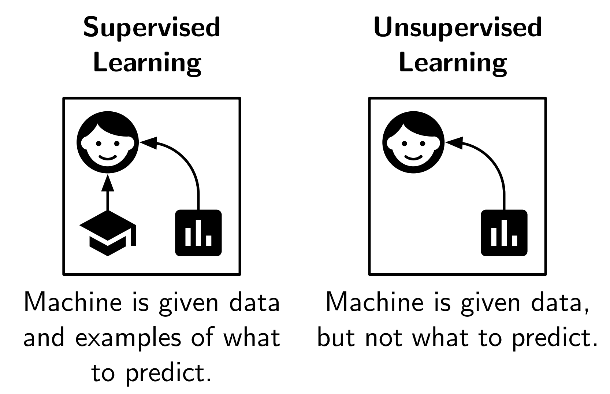

## Talk Overview {.smaller}

- **20-minute** group presentation, 3 speakers
- Covers all of Section 2.1 of *An Introduction to Statistical Learning*:
  1. What Is Statistical Learning?
  2. Why Estimate *f*?
  3. How Do We Estimate *f*?
  4. The Trade-Off Between Prediction Accuracy and Model Interpretability
  5. Supervised vs. Unsupervised Learning
  6. Regression vs. Classification Problems

| Speaker | Topics | Time |
|---|---|---|
| **A** | Intro + Why Estimate *f* | ~6 min |
| **B** | How Do We Estimate *f* + Trade-Offs | ~7 min |
| **C** | Learning Paradigms + Problem Types + Summary | ~6 min |
| All | Q&A | ~1 min |

## What Is Statistical Learning?

- We observe **inputs** ($X_1, X_2, \dots, X_p$) — also called *predictors*, *independent variables*, or *features*
- We observe an **output** ($Y$) — also called the *response* or *dependent variable*
- General relationship:

$$ Y = f(X) + \epsilon $$

- $f$: an unknown, fixed function representing the systematic information $X$ provides about $Y$
- $\epsilon$: a random error term, independent of $X$, with mean zero

::: {.notes}
Motivate with the Advertising dataset: sales as a function of TV, radio, and newspaper budgets. Goal is to estimate f.
:::

## From One Predictor to Many

- With a single predictor, $f$ can be visualized as a curve (e.g., income vs. years of education)
- With multiple predictors, $f$ becomes a surface in higher-dimensional space (e.g., income as a function of *years of education* **and** *seniority*)
- The true $f$ is generally **unknown** — we must estimate it from observed data

<!-- Insert Figure 2.2 (Income vs. years of education) and Figure 2.3 (two-predictor surface) here -->
{fig-alt="Income data set: observed points and true f curve"}

## Why Estimate *f*? — Prediction

- When $X$ is available but $Y$ is not, we predict:

$$ \hat{Y} = \hat{f}(X) $$

- $\hat{f}$ is often treated as a **black box** — accuracy matters more than interpretability
- Prediction accuracy depends on two sources of error:

$$ E(Y - \hat{Y})^2 = \underbrace{[f(X) - \hat{f}(X)]^2}_{\text{Reducible}} + \underbrace{\text{Var}(\epsilon)}_{\text{Irreducible}} $$

- **Reducible error**: can be lowered by choosing a better statistical learning method
- **Irreducible error**: a hard upper bound on accuracy — caused by unmeasured variables or inherent randomness in $Y$

::: {.notes}
Example: predicting a patient's risk of adverse drug reaction from blood-sample variables.
:::

## Why Estimate *f*? — Inference

Sometimes the goal is *understanding*, not just predicting. Key inference questions:

- **Which predictors** are associated with the response?
- **What is the relationship** between each predictor and the response (positive, negative, complex)?
- Can the relationship be **adequately summarized linearly**, or is it more complicated?

- Prediction example: direct-marketing campaign (who will respond?)
- Inference example: which advertising media drive sales, and by how much?
- Some problems need **both** (e.g., real estate pricing)

## Training Data & the Estimation Task

- We observe $n$ data points: $\{(x_1, y_1), (x_2, y_2), \dots, (x_n, y_n)\}$ — the **training data**
- Goal: apply a statistical learning method to the training data to estimate $f$, so that $Y \approx \hat{f}(X)$ for any new observation
- Two broad families of approaches:
  - **Parametric methods**
  - **Non-parametric methods**

## Parametric Methods

Two-step model-based approach:

1. **Assume a functional form** for $f$ — e.g., a linear model:

$$ f(X) = \beta_0 + \beta_1 X_1 + \beta_2 X_2 + \cdots + \beta_p X_p $$

2. **Fit / train** the model using the training data — e.g., via (ordinary) least squares, to estimate $\beta_0, \beta_1, \dots, \beta_p$

- Reduces the problem from estimating an arbitrary $p$-dimensional function to estimating $p+1$ coefficients
- Risk: if the assumed form is far from the true $f$, the estimate will be poor

<!-- Insert Figure 2.4 here: linear model fit to Income data -->
{fig-alt="Linear model fit to the Income data"}

## Non-Parametric Methods

- Make **no explicit assumption** about the functional form of $f$
- Instead, seek an estimate that gets close to the data points without being too rough or too smooth
- **Advantage**: can accurately fit a much wider range of shapes for $f$
- **Disadvantage**: requires a far larger number of observations than parametric approaches

<!-- Insert Figure 2.5 (smooth spline) and Figure 2.6 (rough / overfit spline) side by side -->
::: {.columns}
::: {.column width="50%"}
{fig-alt="Smooth thin-plate spline fit"}
:::
::: {.column width="50%"}
{fig-alt="Rough thin-plate spline fit with overfitting"}
:::
:::

- The rough fit makes **zero errors on training data** but is far more variable than the true $f$ — this is **overfitting**

## Prediction Accuracy vs. Interpretability

- More **flexible** methods can generate a wider range of shapes for $f$
- But increased flexibility generally means **decreased interpretability**

<!-- Insert Figure 2.7 here: flexibility vs. interpretability plot -->
{fig-alt="Trade-off between flexibility and interpretability across methods"}

- Roughly ordered from most interpretable / least flexible to least interpretable / most flexible:
  - Subset Selection, Lasso → Least Squares → GAMs, Trees → Bagging, Boosting → SVMs, Deep Learning
- **When inference is the goal**, simpler, more restrictive models are often preferred
- **When prediction alone is the goal**, a more flexible model is *not always* better — it may overfit

## Supervised vs. Unsupervised Learning

**Supervised learning**

- Each observation $x_i$ has an associated response $y_i$
- Goal: fit a model relating the predictors to the response (most methods in this course)

**Unsupervised learning**

{width=70%}

- Note: **semi-supervised learning** handles the in-between case, where only some observations have a response

## Regression vs. Classification Problems

- **Quantitative** response (numerical values, e.g., price, income, age) → typically a **regression** problem
- **Qualitative / categorical** response (e.g., brand purchased, default: yes/no, cancer diagnosis) → typically a **classification** problem

- Common associations:
  - Linear regression ↔ quantitative response
  - Logistic regression ↔ qualitative (binary) response — though it estimates class *probabilities*, so it can also be viewed as a regression method
- The type of **predictor** (quantitative vs. qualitative) matters less — qualitative predictors just need to be properly **coded** before analysis (covered in Chapter 3)
- Some methods (e.g., K-nearest neighbors) apply to both regression and classification problems

## Summary — Key Takeaways

- Statistical learning is a set of approaches for estimating the unknown function $f$ relating $X$ to $Y$
- Two main goals: **prediction** vs. **inference**
- Two main estimation strategies: **parametric** vs. **non-parametric**
- A fundamental trade-off: **flexibility** vs. **interpretability**
- Two learning paradigms: **supervised** vs. **unsupervised**
- Two problem types: **regression** (quantitative) vs. **classification** (qualitative)

## Thank You

**Questions?**

Speaker A · Speaker B · Speaker C
